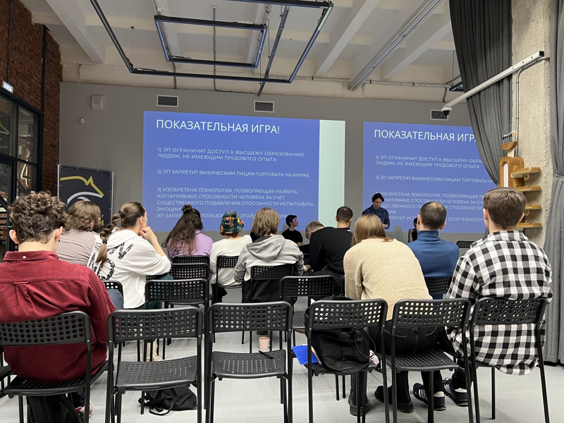

# 28.01.2023: Мастер-класс по парламентским дебатам

Ростовская лига дебатов RDL провела в коворкинге Рубин первое мероприятие для ИТ-специалистов — лекцию по парламентским дебатам, демонстрационную игру и пробную угру с гостями мероприятия. 

Мы встретились с организаторами до мероприятия, обсудили возожные форматы и подходящее даты, возможные площадки под такой формат мероприятия и возможные статьи расходов. Посоветовали остановиться на Рубине, поделились контактами площадки и написали компании, которая согласилась оплатить аренду площадки для RDL. Дополнительно поддержали мероприятие финансово для помощи в организации перекуса.

