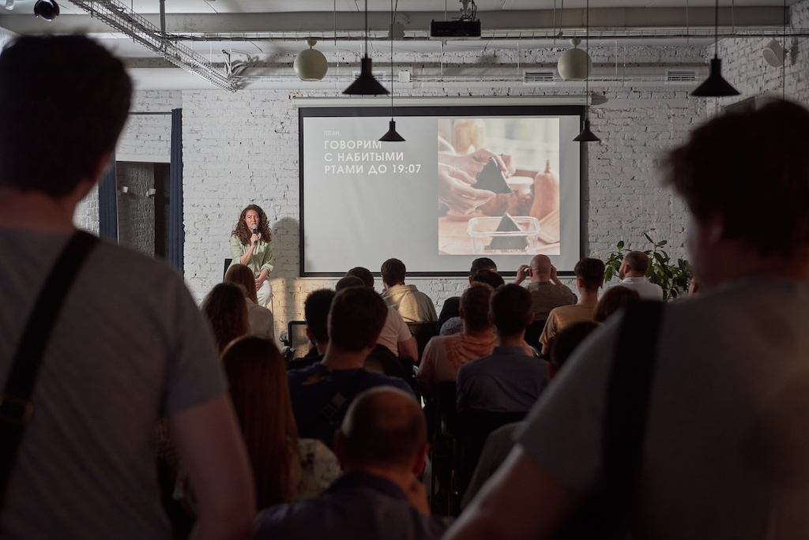

# 22.05.2023: RndTechTalks.DotNet 2

Местное .net сообщество провело митап на новой площадке от Южного ИТ-парка в коворкинге "Луч". 

Митап проходил без привлечения компаний партнеров, общий бюджет мероприятия составил 22.960 рублей:

- 100 онигири для кофе-брейка: 15.000 рублей
- Кофе для кофе-брейка: 4.960 рублей
- Услуги фотографа: 3.000 рублей

25 человек задонатили на мероприятие 8.000 рублей (18 человек задонатили по 250 рублей и 7 человек по 500 рублей). Остальные расходы покрыл NotFound.

Ещё фонд организовал [запись и постобработку докладов](https://www.youtube.com/playlist?list=PLZKHRHuHZs0i-0guyRAYcm-LZzgKtzNSq).

